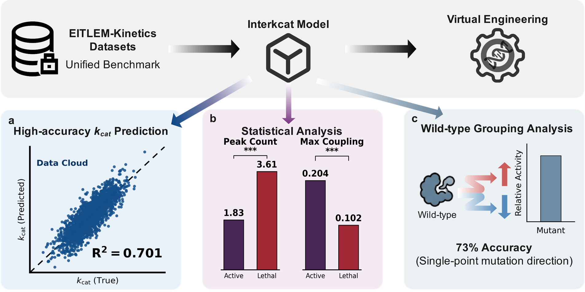

# Interkcat: An Interpretable Bidirectional Cross-Attention Framework for Enzyme Catalytic Efficiency Prediction



*Overview of the Interkcat framework for enzyme kinetics prediction, mechanistic statistical analysis, and virtual engineering.* The Interkcat model leverages the unified EITLEM-Kinetics benchmark dataset to decode enzyme-substrate interactions, establishing an end-to-end pipeline for rational virtual enzyme design.

## Table of Contents

- [Directory Structure and File Descriptions](#directory-structure)
- [Reproducibility](#reproducibility)
- [Acknowledgements](#acknowledgements)
- [License](#license)

## Directory Structure and File Descriptions <a name="directory-structure"></a>

This repository is organized into two main directories: `Codes` and `Data`. Below is a detailed description of the role of each file and folder to help you navigate the repository and reproduce our study.

### `/Codes`
This directory contains all the Jupyter Notebooks and Python scripts required to implement the Interkcat framework, from model training to results visualization.
- **`InterKcat Model.ipynb`**: Contains the core pipeline for training the Interkcat model, including data preprocessing, deep learning architecture instantiation, and performance evaluation.
- **`Model Explaination.ipynb`**: Implements the interpretability modules, detailing the bidirectional cross-attention mechanisms between protein and molecular embeddings.
- **`Model Application.ipynb`**: Demonstrates the practical utility of the framework for virtual enzyme engineering and sequence screening.
- **`Figure.ipynb`**: Generates all the high-quality, multi-panel figures used in the manuscript and Supplementary Information, adhering to top-tier journal formatting standards.
- **`model.py`**: The underlying Python module defining the neural network architectures, graph structures, and attention layers used across the notebooks.

### `/Data`
This directory hosts all the input datasets, generated outputs, evaluation metrics, and configuration files.
- **`5_Independent_Validations/`**: Houses the specific datasets and splits used for the independent validation phases of the model.
- **Input Datasets** (`EITLEM_KCAT.csv`, `EITLEM_KCAT_with_mutations.csv`, `Mutant-info.csv`, etc.): Serve as the comprehensive benchmark and training datasets detailing enzyme-substrate interactions and mutant variations.
- **Output & Analysis** (`model_test_performance.csv`, `Statistical_Analysis.csv`, `single_wt_evaluation_results.csv`, etc.): Store the quantitative results, early stopping logs, and rigorous statistical evaluations produced during model training and testing.
- **`hyperparameters.xlsx`**: Logs the hyperparameter optimization details utilized during the model tuning process.

## Reproducing publication results <a name="reproducibility"></a>

We provide Jupyter Notebooks containing the complete codebase required to reproduce the results presented in our publication. 

### Local Setup Instructions: 

To reproduce our results, please clone this repository to your local machine and ensure you have sufficient GPU resources to complete the full training and evaluation pipeline.

```bash
git clone https://github.com/YourUsername/YourRepositoryName.git
cd YourRepositoryName
```

Due to the CUDA memory limitations of the online workspace, please execute the code blocks sequentially or download the repository to a local machine with sufficient GPU resources to complete the full reproduction. 

**Important Note:** To obtain identical results, it is crucial that the library versions (e.g., transformers, torch) exactly match those specified in the environment configurations.

## Acknowledgements <a name="acknowledgements"></a>

We would like to thank the developers and authors of the following open-source repositories and tools that made this work possible:

- **Progres** - Protein Graph Embedding Search using pre-trained EGNN models
  [Progres](https://github.com/greener-group/progres.git)
- **ESM-2** - Evolutionary Scale Modeling for protein sequence representation
- **PyG (PyTorch Geometric)** & **RDKit** - For molecular graph representation and cheminformatics
- **Biopython** - For sequence alignment and parsing

*(Please add the corresponding GitHub links for the newly added tools if necessary)*

## License <a name="license"></a>

This source code is licensed under the [MIT License](LICENSE).
